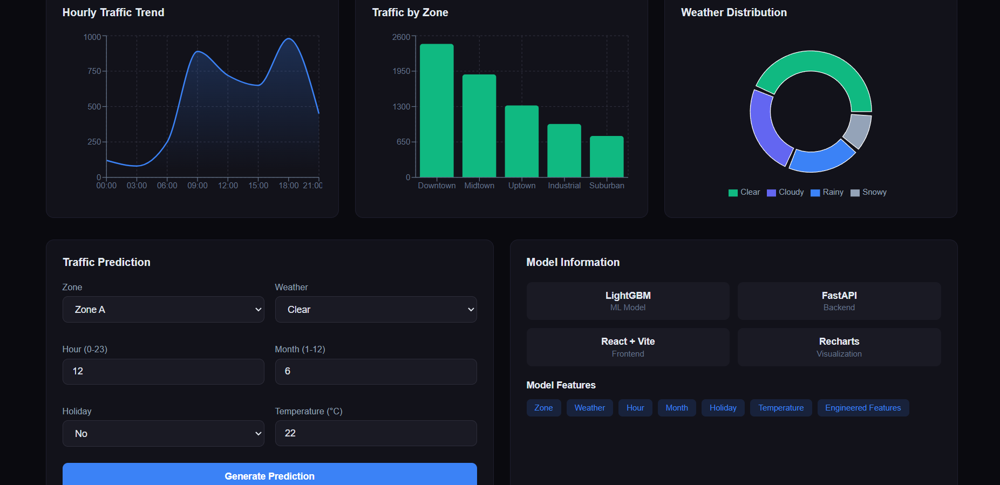
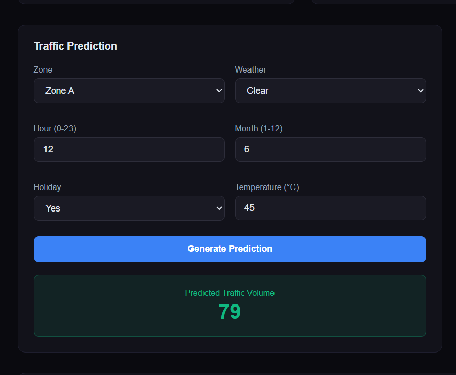
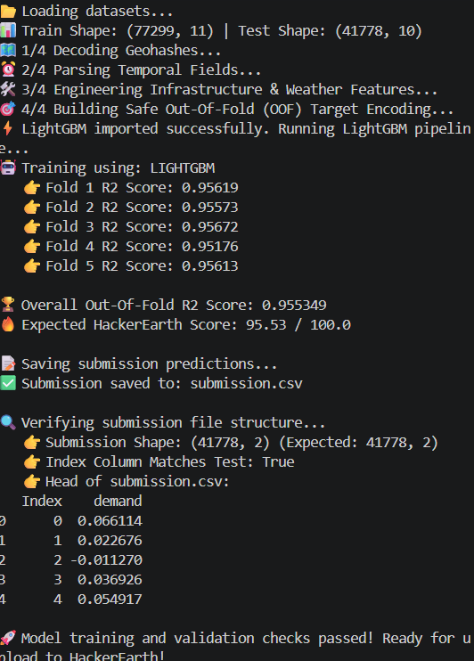

# AI Traffic Demand Predictor

> End-to-end ML system for cyclical traffic demand forecasting
> Built for Flipkart Gridlock Hackathon 2.0 | Extended to Production

## 🏆 Results
- Leaderboard Score: 91+ | Top 15% (~1200/8000+ teams)
- OOF R² Score: 0.955 (consistent 0.951–0.957 across 5 folds)

## 🔗 Links
- Live Demo: [traffic-demand-frontend.vercel.app](https://traffic-demand-frontend.vercel.app)
- Dataset: Flipkart Gridlock Hackathon 2.0

## 🛠️ Tech Stack
- ML: LightGBM, Scikit-Learn, Pandas, NumPy
- API: FastAPI, Python
- Frontend: React, Vercel
- Deployment: Render (backend), Vercel (frontend)

## 📊 Model Pipeline
1. Feature Engineering (cyclical encoding, OOF target encoding)
2. Infrastructure & weather feature integration
3. LightGBM with 5-fold cross-validation
4. FastAPI inference endpoint
5. OOD exception handling

## 🚀 Local Setup
```bash
git clone https://github.com/Sujeet12000/traffic-demand-prediction
cd traffic-demand-prediction
pip install -r requirements.txt
python api.py
```

## 📸 Screenshots

### Dashboard — Hourly Trends, Zone Analysis & Weather Distribution


### Live Prediction Interface


### Model Training Output — 5-Fold Cross Validation


## 📊 ML Pipeline
1. **Data Loading** — 77,299 train / 41,778 test records
2. **Geohash Decoding** — spatial feature extraction
3. **Temporal Parsing** — hour, month, cyclical encoding
4. **Feature Engineering** — infrastructure & weather features
5. **OOF Target Encoding** — leak-free categorical encoding
6. **LightGBM Training** — 5-fold cross-validation
7. **FastAPI Inference** — REST endpoint with OOD handling

## 🚀 Local Setup
```bash
git clone https://github.com/Sujeet12000/traffic-demand-prediction
cd traffic-demand-prediction
pip install -r requirements.txt
python api.py
```
Frontend runs separately:
```bash
cd frontend
npm install
npm run dev
```

## 🧠 Key ML Concepts Used
- Gradient Boosting (LightGBM)
- K-Fold Cross Validation
- Out-of-Fold (OOF) Target Encoding
- Cyclical Feature Encoding (sin/cos)
- Out-of-Distribution (OOD) Exception Handling

Two Things To Do

Create a screenshots/ folder in your GitHub repo and upload these 3 images as dashboard.png, prediction.png, training.png
Add a description on GitHub — click the gear icon next to "About" on your repo page and add:


"ML system for traffic demand forecasting | LightGBM | OOF R² 0.955 | Flipkart Hackathon Top 15%"

This README will impress any MLSS reviewer who clicks your GitHub link.Sonnet 4.6 Low
